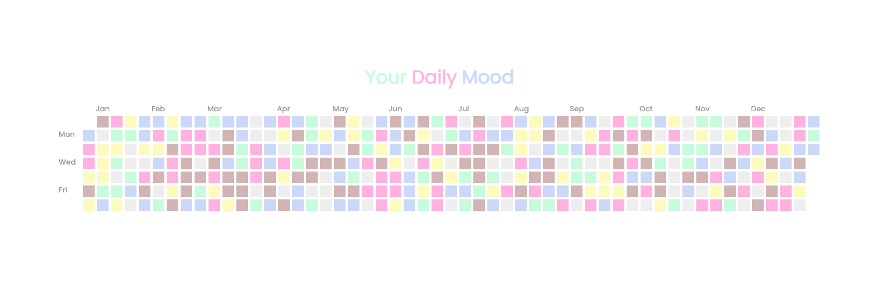
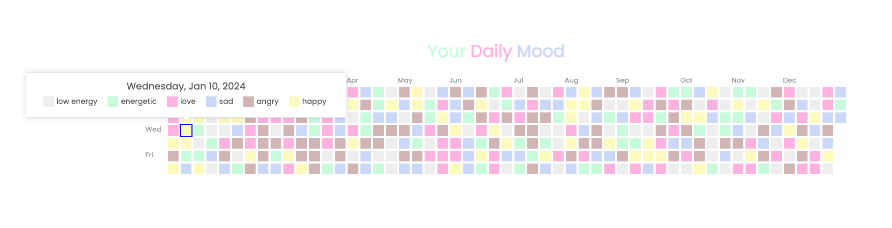

# daily-mood-tracker
Daily Mood Tracker is a Vue component that visualizes mood of a whole YEAR by heatmap. It allows users to track their moods over time and gain insights into their emotional patterns.

## Demo



## How to run
```
cd daily-mood-tracker
npm install
npm run dev
```
